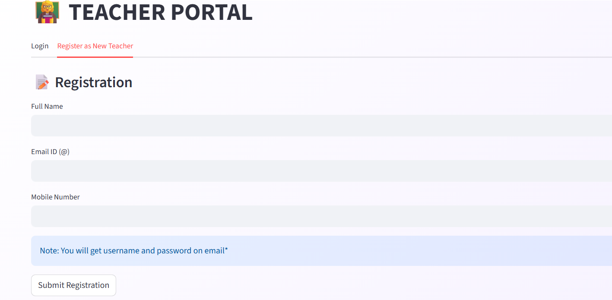
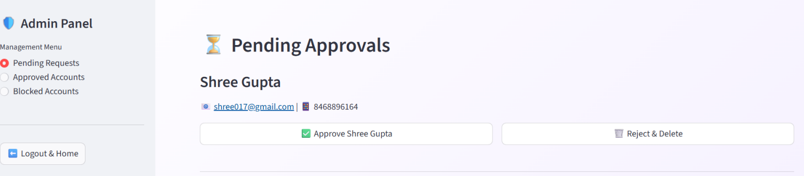
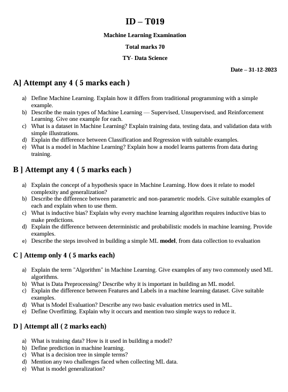
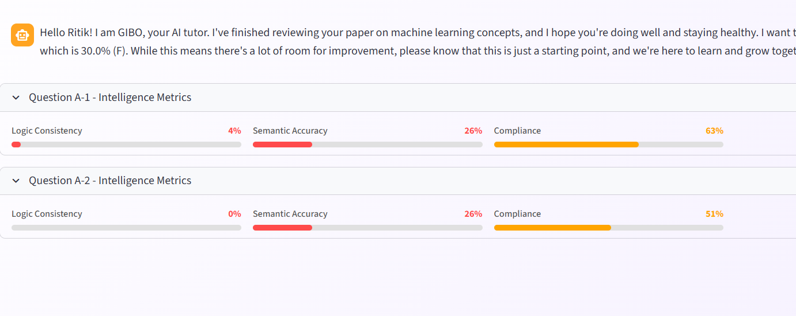
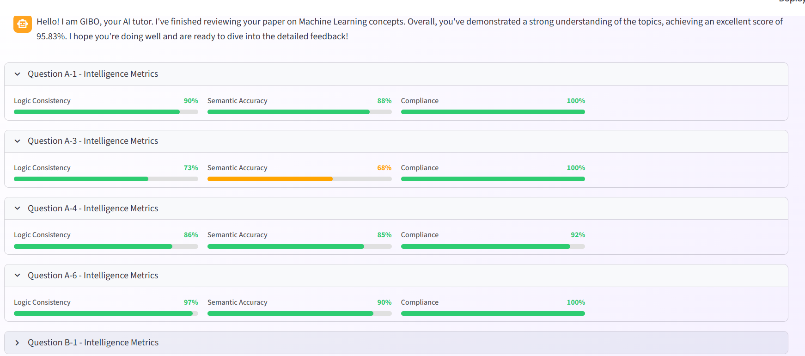
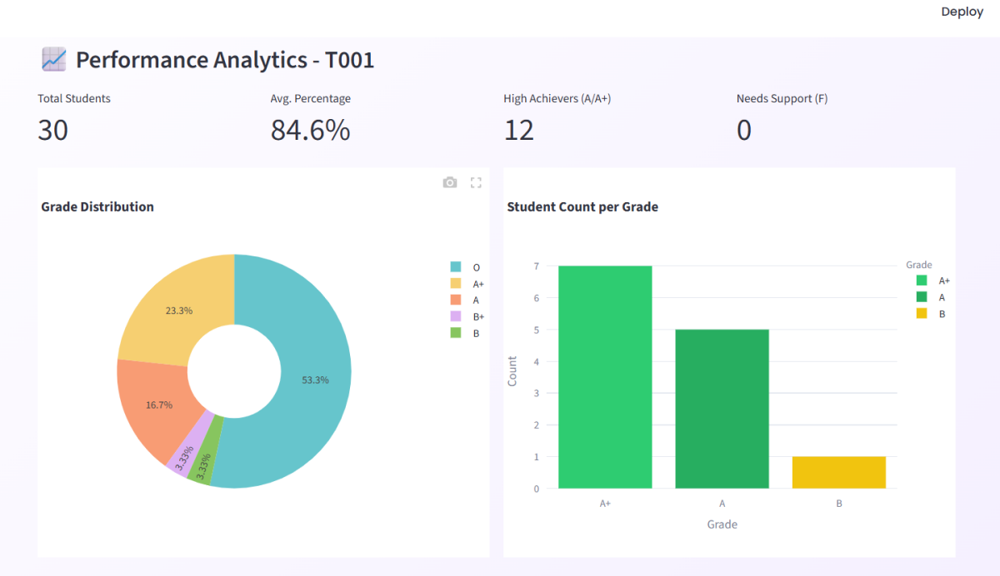
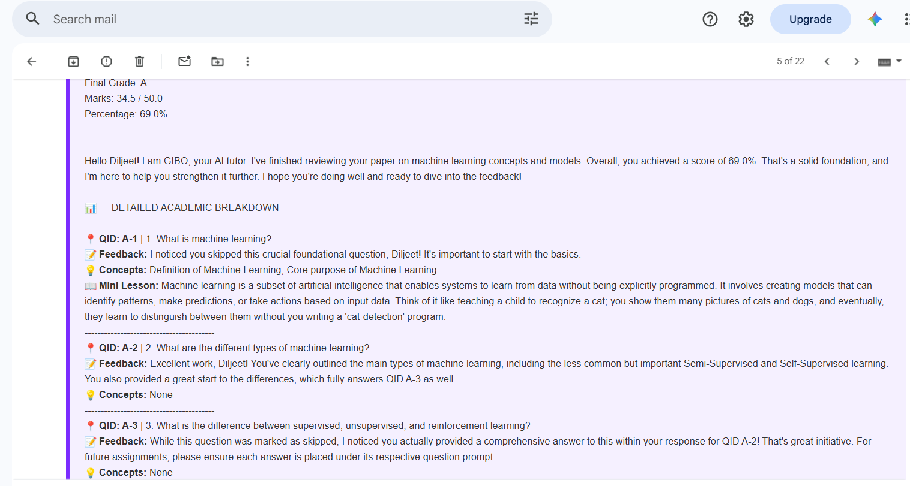

<style>
  img {
    border: 2px solid #30363d;
    border-radius: 8px;
    box-shadow: 0 4px 8px rgba(0,0,0,0.15);
    margin-top: 12px;
    margin-bottom: 8px;
    max-width: 85%;
    height: auto;
    display: block;
  }
</style>

# GIBO: Grade & Guide with GIBO
### *An Automated AI-Driven Evaluation System with Personalized Remedial Micro-Lessons*

GIBO (**Grading Intelligence for Behavioral Optimization**) is an end-to-end, multi-model evaluation and feedback system engineered for descriptive theory examinations in Machine Learning. Unlike conventional auto-graders that rely on shallow keyword matching, GIBO enforces strict institutional examination rules (section attempt limits, length compliance, and mark-mapping policies) while providing explainable grading and targeted micro-lessons directly to students.

---

## Key Highlights & Performance Metrics

* **Evaluation Accuracy**: Achieved **86.22% overall grading accuracy** against human evaluator baselines across complex descriptive answers.
* **Custom Dataset Engineering**: Built a proprietary dataset over **6 months** containing **~1,030 answer sheets** (~30 student sheets per Question Paper template) and over **12,000 Question-Answer pairs**.
* **High-Throughput Batch Processing**: Enables batch evaluations of **50+ student answer sheets** per grading session against a single question paper template.
* **Explainable AI Diagnostics**: Powered by **Gemini 1.5 Flash**, delivering Tri-Level Diagnostics (personalized feedback, missing concept identification, and tailored mini-lessons).
* **Automated Delivery Pipeline**: Compiles diagnostic reports and delivers itemized results directly to student email inboxes.

---

## Core System Architecture

GIBO operates across a 7-stage pipeline that bridges raw text extraction, deep semantic comparison, regressive score prediction, and LLM-driven feedback generation:


*Figure 1: High-level 7-module block diagram illustrating the GIBO processing pipeline.*

### Pipeline Breakdown:
1. **Question Paper Configuration and Parsing**: Parses complex multi-section question paper templates, extracting attempt constraints, mark allocations, and question definitions.
2. **Student Registration and Answer Sheet Management**: Digitizes, cleans, and indexes student response files against metadata schemas.
3. **Question–Answer Structuring and Rule Mapping**: Enforces institutional rules (e.g., "Attempt any 4 of 5") and dynamically computes maximum allowable marks per section.
4. **AI-Based Feature Extraction**: Embeds student responses and compares them against ideal candidate answers using **MiniLM** and **DeBERTa-v3** to extract semantic, logical, and structural features.
5. **Rule-Constrained Marks Allocation**: Uses an **XGBoost Regressor** to predict scores based on weighted semantic similarity, logical coherence, and strict length compliance heuristics.
6. **Feedback and Lesson Generation**: Leverages **Gemini 1.5 Flash** to analyze answer gaps and construct targeted mini-lessons for skipped or sub-optimal responses.
7. **Result Compilation and Delivery**: Automatically aggregates section scores, grade distributions, and feedback into direct student email reports and faculty dashboards.

---

## Machine Learning & Feature Engineering Pipeline

### Multi-Model Feature Extraction
To capture deep answer semantics rather than simple syntax, GIBO calculates three primary feature dimensions:

* **Semantic Similarity (Weight: 0.5)**: Powered by **DeBERTa-v3** to capture contextual and deep semantic alignment against ideal responses.
* **Logic & Structure (Weight: 0.4)**: Powered by **MiniLM** to evaluate concept flow, domain terminology consistency, and argument structure.
* **Length Compliance (Weight: 0.1)**: Strictly enforces target word count boundaries calibrated by question weightage:
  * **2 Marks**: 60–70 words
  * **5 Marks**: 120–130 words
  * **8 Marks**: 140–150 words
  * **10 Marks**: 170–200 words

### Marks Prediction Engine
Extracted feature vectors (Semantic, Logic, and Length Compliance scores) are passed into an **XGBoost Regressor** trained on 12,000+ human-graded question-answer pairs. The model outputs precise scores while adhering strictly to rule-constrained upper limits dictated by section-level attempt policies.

---

## Custom Dataset Engineering

Due to the lack of publicly available descriptive answer datasets for specialized engineering curricula, a proprietary benchmark dataset was systematically built over a 6-month development cycle:

* **Answer Sheets Processed**: ~1,030 full-length student answer sheets.
* **Question-Answer Pairs**: 12,000+ individually annotated responses.
* **Exam Templates**: Multiple distinct question paper structures covering core Machine Learning concepts (Supervised/Unsupervised Learning, Neural Networks, Optimization, Regularization, and Evaluation Metrics).
* **Ground Truth Annotation**: Each response was dual-graded by domain experts across correctness, logical structure, and clarity.

---

## Technical Stack

* **Machine Learning & NLP**: XGBoost, DeBERTa-v3, Sentence-Transformers (MiniLM), PyTorch, Scikit-learn
* **Large Language Models**: Gemini 1.5 Flash (Prompt Engineering, Tri-Level Remedial Generation)
* **Data Processing & Backend**: Python 3.10+, Pandas, NumPy, SQL
* **Notification Engine**: SMTP Email Service Engine

---

## System UI & Step-by-Step Workflow Walkthrough

### 1. Home Page & Portal Entry
The landing interface establishing core value propositions, system capabilities, and navigation portals for both teachers and administrative personnel.


*Figure 2: GIBO primary landing platform and navigation entry point.*

---

### 2. User Authentication & Administrative Approvals
Teachers register or log in via the dedicated portal, while administrators review, manage, and grant access through a secure control panel.



*Figure 3: Teacher Portal registration and authentication entry point.*

<br/>



*Figure 4: Administrative portal for reviewing access requests and user controls.*

---

### 3. Faculty Dashboard & Academic Records
Upon successful login, teachers enter the main dashboard where they can select a Question Paper template to view enrolled students, past submission records, and historical academic performances.


*Figure 5: Academic Insights dashboard showing student records and question paper selection.*

---

### 4. Question Paper Structure & Schema Demo
Instructors can inspect the reference Question Paper, its digitised schema, and the underlying section rules before evaluating submissions.


*Figure 6: Digitized examination question paper view.*

<br/>



*Figure 7: Structured Question Paper template mapping rules and mark weightages.*

---

### 5. Initiating New Ingestion & Automated Processing
To evaluate new submissions, the instructor clicks the **"Grade New Student"** button, uploads the Question Paper along with student answer files, configures metadata, and triggers the automated pipeline.


*Figure 8: Batch upload panel for question templates and student answer sheets.*

<br/>


*Figure 9: Form-based Metadata configuration for section attempt rules and score constraints.*

<br/>


*Figure 10: Processed and indexed student answer sheet ready for automated evaluation.*

---

### 6. Automated Scoring, Attempt Auditing & AI Diagnostics

> **Student-Specific Diagnostic Inspection:** 
> When an instructor selects an individual student from the cohort list, all downstream reports—including the **Attempt Audit Table**, **Metric Score Bars**, and **AI Explanation Reports**—dynamically isolate and display the granular, question-by-question breakdown for that specific student. This allows faculty to inspect exactly how the AI reached its mark allocation for any given individual.


*Figure 11: Itemized attempt audit report showing attempted vs unattempted questions for the selected student.*

<br/>



*Figure 12: Individual student metric breakdown displaying Logic Consistency, Semantic Accuracy, and Compliance per question.*

<br/>



*Figure 13: Detailed explainable AI feedback revealing the exact rationale behind score deductions and criteria matches for the selected student.*

---

### 7. AI Remedial Micro-Lessons & Personalized Tutoring
For missing concepts or low-scoring answers identified during the individual diagnostic audit, GIBO leverages Gemini 1.5 Flash to automatically generate custom feedback, corrections, and tailored remedial lessons.


*Figure 14: Automated evaluation feedback and immediate correction hints generated for the student.*

<br/>


*Figure 15: AI-generated micro-lesson teaching missing concepts directly tailored to the student's gaps.*

---

### 8. Pedagogical Analytics & Direct Email Delivery

> **Exam-Level & Cohort Insights:** 
> Unlike the individual student reports above, the **Skipped Questions Analytics** aggregate data across all students (e.g., all 30 student submissions under template `T001`). This provides faculty with macro-level insights into which specific questions or core concepts were most frequently skipped or failed across the entire batch, highlighting topics that require classroom re-teaching.



*Figure 16: Class grade distribution analytics and overall batch performance breakdown.*

<br/>


*Figure 17: Cohort-level aggregate analytics highlighting frequently skipped questions across all candidates for a specific Question Paper template.*

<br/>


*Figure 18: Detailed list mapping frequently skipped questions back to individual student records.*

<br/>



*Figure 19: Diagnostic evaluation report delivered directly to an individual student's inbox via email.*

---

## Getting Started & Setup Guide

### 1. Prerequisites
* **Python 3.10** installed on your system.
* **CUDA-compatible GPU** (Recommended for accelerated DeBERTa-v3 and MiniLM inference).
* Accounts for **Google AI Studio** (Gemini API), **Hugging Face**, and an **Email Provider** (e.g., Gmail).

---

### 2. Service Credentials Setup

#### A. Generating Gemini API Key
1. Visit [Google AI Studio](https://aistudio.google.com/).
2. Sign in with your Google account.
3. Click on **Get API Key** and generate a new API key.
4. Copy the generated key for your environment variables.

#### B. Generating Hugging Face Token
1. Go to [Hugging Face](https://huggingface.co/) and log in.
2. Navigate to **Settings** -> **Access Tokens**.
3. Click **New Token**, set the role to `Read`, name it (e.g., `GIBO_Model_Access`), and click **Generate**.
4. Copy your token string.

#### C. Setting Up Gmail App Passwords (Sender Email)
To send automated result reports to students, configure a Gmail App Password:
1. Go to your [Google Account Security Settings](https://myaccount.google.com/security).
2. Enable **2-Step Verification** if it is not already enabled.
3. Search for **App Passwords** in the security settings search bar.
4. Enter an app name (e.g., `GIBO System`) and click **Create**.
5. Copy the 16-character generated passkey (without spaces).

---

### 3. Installation Steps

1. **Clone the Repository**:
   ```bash
   git clone [https://github.com/Dhanshree017/AI-Grading-System.git](https://github.com/Dhanshree017/AI-Grading-System.git)
   cd AI-Grading-System
